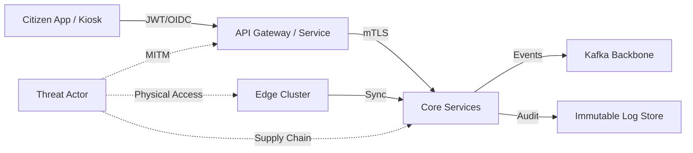

# Threat Model – JanSaarthi AI

## Key Assets
| Asset | Description | Sensitivity | Primary Controls |
|---|---|---|---|
| Citizen Profile Data | Demographics, attributes, eligibility inputs | High | AES-256 at rest, RBAC/ABAC, audit logs |
| Consent Ledger | Consent tokens, scopes, expiry | High | Immutable logs, RBAC, token binding |
| Policy Bundles | Deterministic rules and versions | High | Versioning, signed artifacts, change control |
| Eligibility Decisions | Outputs + explanations | High | Immutable audit trail, replayability |
| Event Streams | Kafka topics, schema registry | High | TLS/mTLS, ACLs, retention controls |
| Knowledge Graph | Scheme relationships, dependencies | Medium | Access control, versioning |
| Edge Caches | Offline profiles, policy bundles | High | Local encryption, device attestation |
| ML Models | ASR/TTS, analytics models | Medium | Signed artifacts, secure distribution |

## Threat Actors and Attack Vectors
| Actor | Vector | Impact | Likelihood |
|---|---|---|---|
| External adversary | API abuse, credential stuffing | Data exposure, service disruption | Medium |
| Insider (privileged) | Policy tampering, data exfiltration | Unauthorized eligibility decisions | Medium |
| Supply-chain | Dependency compromise, image poisoning | Integrity breach | Medium |
| Edge compromise | Physical device access, malware | Local data leakage | High |
| Network attacker | MITM, replay attacks | Token theft, data tamper | Medium |

## Mitigations and Controls
| Control Area | Controls | Notes |
|---|---|---|
| AuthN/AuthZ | OIDC/JWT with issuer/audience validation, RBAC/ABAC | Role claims required for every endpoint |
| Transport Security | TLS 1.3, optional mTLS between services | Enforce in prod |
| Data at Rest | AES-256, disk encryption, DB TDE | Edge stores encrypted |
| Policy Integrity | Versioned bundles, signed artifacts, approvals | Rollback by version pointer |
| Auditability | Event sourcing, immutable logs, trace IDs | Full replayability |
| Edge Security | Secure boot, device attestation, local encryption | Offline-first constraints |
| Supply Chain | Signed images, SCA scanning, pinning | CI/CD enforcement |

## Threat Flow Diagram

